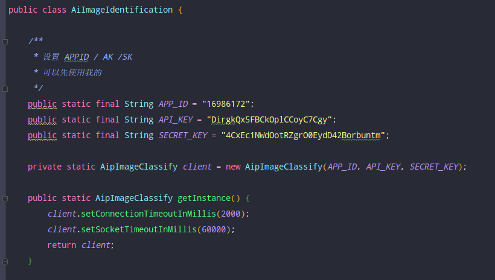
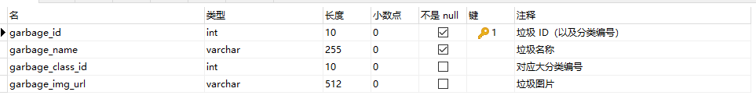
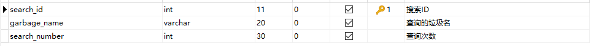
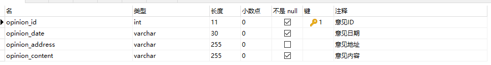

# 垃圾分类微信小程序（后台代码）

配合[前端代码](https://github.com/Chentyit/GarbageWeiXinApp)使用

## 使用技术

基础框架：Spring + SpringMVC + MyBatis

图像识别：百度 AI 图像识别接口（可以直接使用我的，也可以自己去申请，替换掉对应的 APP_ID，API_KEY，和 SECRET_KEY）



## 数据库表设计

**垃圾表**



**搜索表**



**意见表**



用于测试的 SQL 的文件在 testsql 文件夹中

## Controller 接口

```
/garbage/allGar -- 搜索出所有的垃圾
/garbage/allClass -- 搜索出所有的垃圾类别
/garbage/search -- 通过关键字搜索某个垃圾的详细信息
/garbage/list -- 根据搜索的次数降序排序输出搜索排行
/garbage/byCId/ --  根据类别 ID 查询出归属于这个分类下的垃圾
/garbage/allInfoList -- 获取拉结类别以及类别下的所有垃圾的总列表
/garbage/image -- 接收传递过来的图片
```

~~~
/opinion/addOp -- 向后台添加用户提交的意见
/opinion/search -- 通过意见的 ID 查询意见信息
/opinion/del -- 通过意见的 ID 删除意见信息
~~~

（具体参数可以到 web 模块的 com.iweb.controller 查看）
